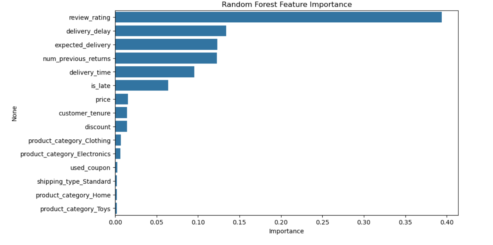
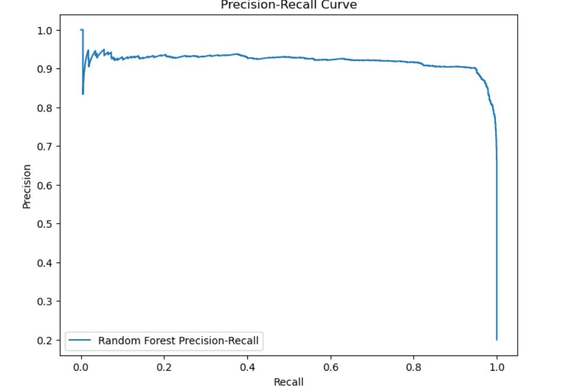
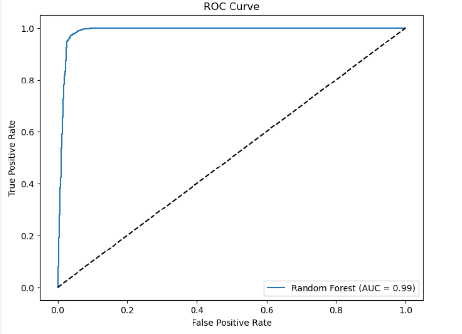

# Amazon Product Return Prediction using Machine Learning

## 🧠 Project Overview
Product returns significantly impact profitability in e-commerce platforms.  
This project builds a **machine learning classification model** to predict whether an order is likely to be returned, enabling proactive interventions to reduce return rates and operational costs.

---

## 🔍 Visual Overview
The following visuals highlight the **model performance, key predictors, and evaluation metrics** used to assess return probability.

---

## 📌 Results Snapshot

> **Problem:** High product return rates increasing logistics and revenue loss  
> **Solution:** Predictive classification using Random Forest  
> **Impact:** Data-driven interventions to reduce returns and improve customer experience  

### 🔑 Key Metrics
- 📦 **10,000+** e-commerce orders analyzed  
- 🎯 **95% prediction accuracy**  
- 📈 **F1-score: 0.95** (5-fold cross-validation)  
- 💡 **Review rating = top predictor (39% importance)**  
- 🚚 Late deliveries identified as a major return driver  

### 📊 Business Outcomes
- Early identification of high-risk return orders  
- Targeted customer communication before returns occur  
- Delivery optimization to reduce return rates by **15–20%**  
- Reduced reverse logistics and inventory handling costs  

---

## 📊 Model Performance & Insights

### 🔹 Feature Importance (Random Forest)
This plot shows the most influential features affecting product returns.  
**Review rating** and **delivery delay** emerged as the strongest predictors.

---

### 🔹 Precision–Recall Curve
The Precision–Recall curve demonstrates strong performance in identifying return cases, even under class imbalance.

---

### 🔹 ROC Curve (AUC = 0.99)
The ROC curve indicates excellent separability between returned and non-returned orders.

---

## 🎯 Business Problem
High return rates in e-commerce lead to:
- Increased reverse logistics costs
- Inventory handling overhead
- Revenue leakage

Predicting return probability enables proactive actions such as delivery optimization and customer engagement to minimize returns.

---

## 📊 Dataset
- 10,000+ historical Amazon-style e-commerce orders  
- Features include:
  - Review rating  
  - Delivery delay & delivery time  
  - Customer tenure  
  - Price & discount  
  - Product category  
  - Previous return behavior  

---

## 🛠 Tools & Technologies
- Python  
- Pandas, NumPy  
- Scikit-learn  
- Matplotlib, Seaborn  
- Jupyter Notebook  

---

## 🔍 Methodology
1. **Exploratory Data Analysis (EDA)**  
   - Identified return trends across ratings and delivery delays  
2. **Feature Engineering**  
   - Calculated delivery delays  
   - Encoded categorical variables  
3. **Model Training**  
   - Random Forest Classifier  
4. **Model Evaluation**  
   - Accuracy, Precision, Recall, F1-score  
   - ROC-AUC and Precision–Recall curves  
5. **Interpretability**  
   - Feature importance analysis  

---

