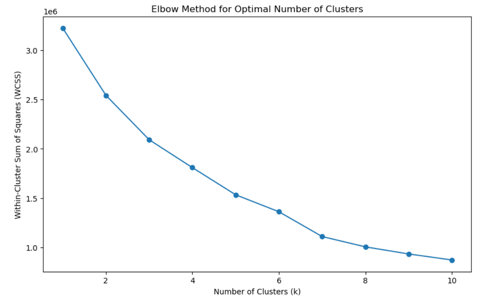
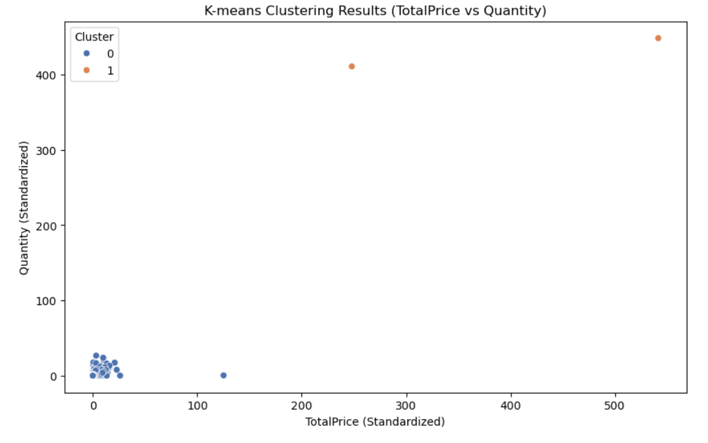

# Customer Segmentation Analysis using K-Means

## 🧠 Project Overview
This project applies **K-Means clustering** on large-scale online retail transaction data to segment customers based on purchasing behavior.  
The objective is to identify **high-value customers**, improve **repeat purchase rates**, and enable **targeted marketing strategies**.

---

## 🎯 Business Problem
Online retailers generate massive transactional data but often rely on generic marketing approaches.  
This results in:
- Low repeat purchase rates (~1.5 purchases per customer)
- Poor customer targeting
- Missed revenue opportunities  

This project transforms raw transaction data into **actionable customer segments** to support data-driven decision-making.

---

## 📊 Dataset
- ~400,000 cleaned transaction records  
- Original size: 541,909 rows → cleaned to ~397,000  
- Key features used:
  - Quantity  
  - Unit Price  
  - Total Spend (Quantity × Unit Price)  
  - Purchase Frequency  
  - Time-based features (Hour, Day, Month)

---

## 🛠 Tools & Technologies
- Python  
- Pandas, NumPy  
- Scikit-learn  
- Matplotlib, Seaborn  
- Jupyter Notebook  

---

## 🔍 Methodology
1. **Data Cleaning**  
   - Removed duplicates, missing values, and negative transactions  
2. **Feature Engineering**  
   - Created TotalPrice and PurchaseFrequency features  
3. **Standardization**  
   - Scaled numerical variables for fair clustering  
4. **Clustering**  
   - Applied K-Means clustering  
   - Optimal number of clusters (k = 2) determined using the Elbow Method  
5. **Cluster Profiling**  
   - Analyzed clusters using statistical summaries and visualizations  

---

## 📊 Cluster Visualizations

### 🔹 Optimal Number of Clusters (Elbow Method)
The Elbow Method was used to determine the optimal number of clusters.  
A clear bend at **k = 2** indicates the most meaningful segmentation.

---

### 🔹 Customer Segmentation – Cluster Distribution
This scatter plot highlights clear separation between customer groups based on **Total Spend** and **Purchase Quantity**.

---

## 📈 Key Results
- Identified **2 distinct customer segments**  
- **22% of customers contributed ~80% of total revenue**  
- Insights indicate **20–30% potential increase in repeat purchases**

---

## 👥 Customer Segments Identified

### 🔹 Cluster 0 – Budget-Conscious Browsers
- 78% of customers  
- Low purchase frequency  
- Higher unit prices  
- Infrequent and selective buying behavior  

**Business Opportunity:**  
Convert these customers into repeat buyers using personalized recommendations and premium-focused offers.

---

### 🔹 Cluster 1 – High-Volume Value Seekers
- 22% of customers  
- High purchase quantity and frequency  
- Lower unit prices  
- Generates the majority of revenue  

**Business Opportunity:**  
Retain high-value customers through loyalty programs, bulk discounts, and subscription-based offers.

---

## 💡 Actionable Business Insights
- Prioritize retention strategies for high-value customers  
- Use targeted campaigns to convert browsers into repeat buyers  
- Schedule promotions during peak shopping hours  
- Optimize inventory planning based on segment behavior  

---

